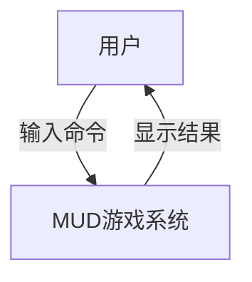
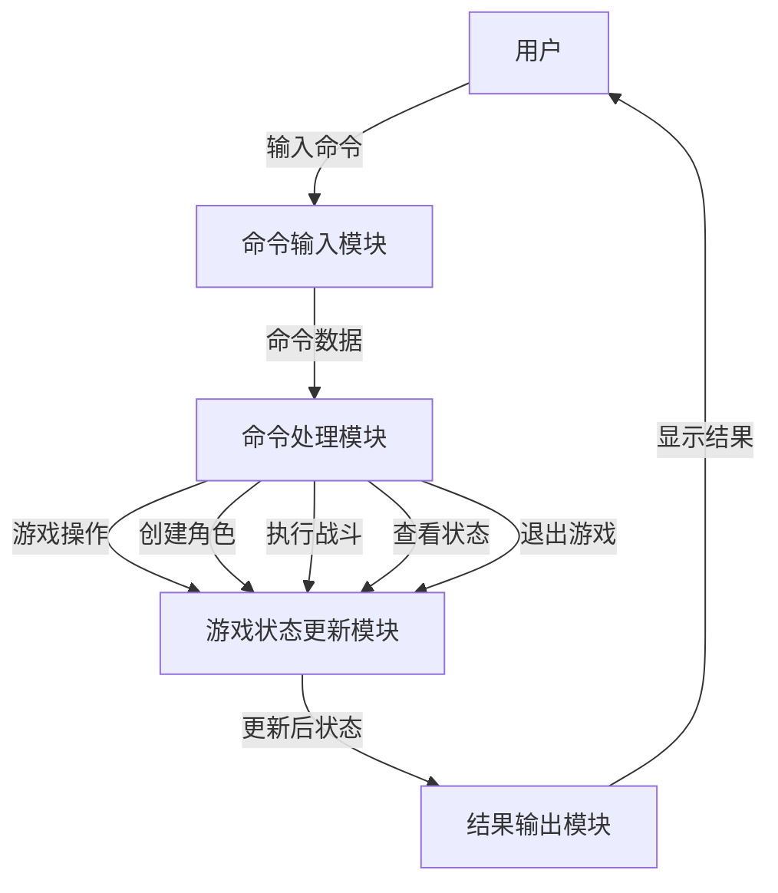
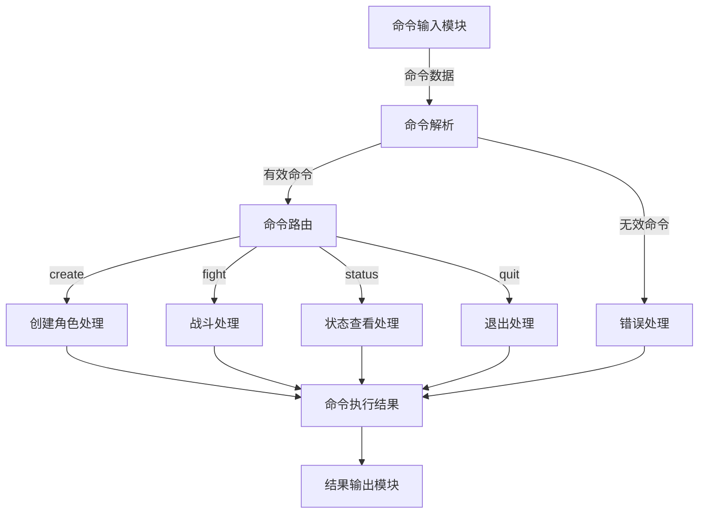

# 需求规格说明书 (SRS) 更新

## 1. 核心业务用例图

### 1.1 用例图

```mermaid
useCaseDiagram
    participant User as "用户"
    participant GameEngine as "游戏引擎"
    participant CreateCharacter as "创建角色"
    participant Battle as "战斗"
    participant CheckStatus as "查看状态"
    participant QuitGame as "退出游戏"
    participant LevelUp as "升级"
    
    User --> GameEngine
    GameEngine -- includes --> CreateCharacter
    GameEngine -- extends --> Battle
    GameEngine -- extends --> CheckStatus
    GameEngine -- extends --> QuitGame
    Battle -- extends --> LevelUp
```

### 1.2 用例描述

| 用例名 | 参与者 | 描述 | 前置条件 | 后置条件 |
|--------|--------|------|----------|----------|
| 创建角色 | 用户 | 创建新的游戏角色 | 游戏已启动，未创建角色 | 角色创建成功，可进行其他操作 |
| 战斗 | 用户 | 角色进行战斗，获得经验，减少血量 | 已创建角色 | 战斗结束，角色状态更新 |
| 查看状态 | 用户 | 查看角色当前状态 | 已创建角色 | 显示角色状态信息 |
| 退出游戏 | 用户 | 退出游戏系统 | 游戏已启动 | 游戏退出 |
| 升级 | 系统 | 角色经验达到阈值时自动升级 | 角色经验 >= 100 | 角色等级提升，经验重置，血量回满 |

## 2. DFD 数据流图

### 2.1 顶层 DFD



### 2.2 第一层 DFD



### 2.3 第二层 DFD - 命令处理模块



## 3. 功能需求

| 编号 | 功能点 | 描述 | 输入 | 输出 |
|------|--------|------|------|------|
| FR1 | 角色创建 | 创建新的游戏角色，设置初始属性 | create <角色名> | 角色创建成功消息 |
| FR2 | 战斗系统 | 角色进行战斗，增加经验，减少血量 | fight | 战斗结果，包括经验获得和血量变化 |
| FR3 | 状态查看 | 显示角色当前状态，包括等级、血量、经验 | status | 角色状态信息 |
| FR4 | 游戏退出 | 退出游戏系统 | quit | 退出消息 |
| FR5 | 升级系统 | 角色经验达到阈值时自动升级，重置经验，回满血量 | 自动触发 | 升级成功消息 |

## 4. 非功能需求

| 编号 | 需求点 | 描述 |
|------|--------|------|
| NFR1 | 可扩展性 | 系统设计应支持后续功能扩展，如房间系统、物品系统等 |
| NFR2 | 可维护性 | 代码结构清晰，模块化设计，易于维护和修改 |
| NFR3 | 响应时间 | 命令执行响应时间应在1秒内 |
| NFR4 | 容错性 | 对无效命令和输入应有合理的错误处理 |
