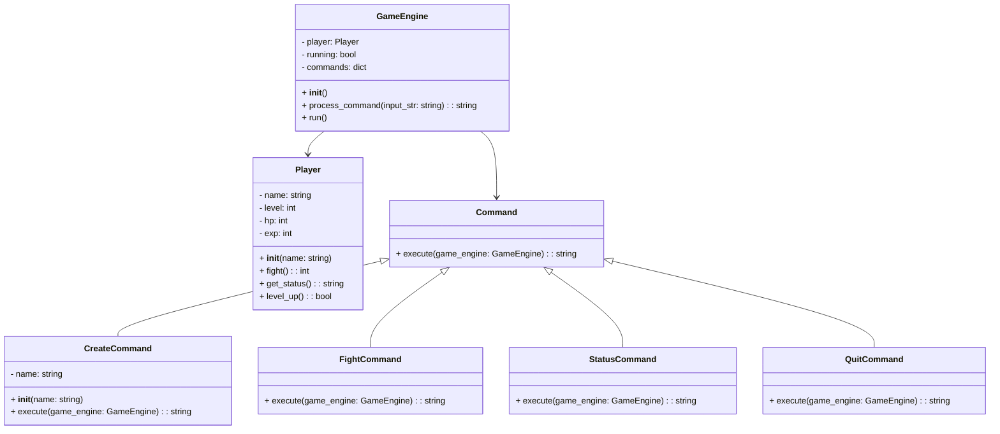
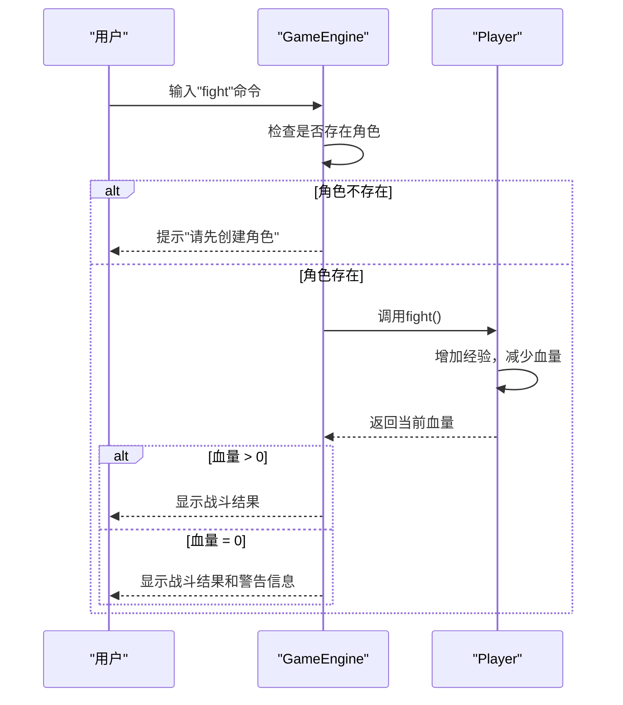

# MUD游戏OOA逆向蓝图指导重构报告

## 项目分析与建模成果

### 1. 代码结构分析

原始MUD游戏代码包含一个`Player`类和`main`函数，核心功能包括：

- 角色创建
- 战斗（增加经验，减少血量）
- 状态查看
- 游戏退出

### 2. 用例图

**核心用例**：

- **游戏主循环**（主用例）
- **角色创建**（Include关系）
- **战斗**（Extend关系）
- **查看状态**（Extend关系）
- **退出游戏**（Extend关系）

```mermaid
useCaseDiagram
    participant User as "用户"
    participant GameEngine as "游戏引擎"
    participant CreateCharacter as "创建角色"
    participant Battle as "战斗"
    participant CheckStatus as "查看状态"
    participant QuitGame as "退出游戏"
    participant LevelUp as "升级"
    
    User --> GameEngine
    GameEngine -- includes --> CreateCharacter
    GameEngine -- extends --> Battle
    GameEngine -- extends --> CheckStatus
    GameEngine -- extends --> QuitGame
    Battle -- extends --> LevelUp
```

### 3. 静态类图

**实体类**：

- `Player`类：
  - 属性：name, level, hp, exp
  - 方法：__init__, fight, get\_status



### 4. 顺序图（战斗流程）

**核心流程**：

1. 用户输入"fight"命令
2. 系统检查是否存在角色
3. 调用Player.fight()方法
4. 增加经验，减少血量
5. **Alt片段**：
   - 血量 > 0：显示战斗结果
   - 血量 = 0：显示战斗结果和警告信息



### 5. 架构审查

**问题识别**：

- `main`函数承担过多职责（命令解析、游戏状态管理）
- 缺乏模块化设计，难以扩展
- 命令处理逻辑与业务逻辑耦合

### 6. 重构方案

**面向对象设计改进**：

1. **封装**：创建`GameEngine`类管理游戏状态
2. **继承**：实现`Command`基类和具体命令子类
3. **多态**：通过Command模式处理不同命令

**具体实现**：

- `GameEngine`类：管理游戏状态和命令执行
- `Command`基类及子类：处理具体命令逻辑
- 扩展`Player`类：添加升级功能
- 模块化设计：便于后续扩展（如添加房间、物品系统）

### 7. 交付物准备

**分阶段交付物**：

1. **Sprint 2 团队分工**：
   - 代码分析与建模：负责用例图、类图、顺序图生成
   - 架构审查：负责识别设计问题
   - 重构实现：负责代码重构和测试
   - 文档整理：负责DFD和重构报告编写
2. **系统数据流图 (DFD)**：
   - 顶层：用户 → MUD游戏系统
   - 第一层：命令输入 → 命令处理 → 游戏状态更新 → 结果输出
3. **核心用例图**：
   - 主用例：游戏主循环
   - 包含关系：角色创建
   - 扩展关系：战斗、状态查看、游戏退出
4. **动态顺序图与全局类图**：
   - 战斗流程顺序图（含Alt片段）
   - 静态类图（Player、GameEngine、Command及其子类）
5. **架构审查与重构报告**：
   - 现有系统问题：main函数职责过重、缺乏模块化
   - 重构方案：引入GameEngine类、Command模式
   - 预期效果：提高代码可维护性和可扩展性

## 重构效果

重构后的MUD游戏代码实现了：

- 清晰的责任分离
- 模块化设计
- 易于扩展的命令系统
- 面向对象原则的应用

通过OOA逆向蓝图的指导，成功将简单的脚本式代码重构为具有良好设计的面向对象系统，为后续功能扩展（如房间系统、物品系统、战斗系统优化）奠定了基础。

## 重构代码

```python
class Player:
    """玩家类，用于存储角色状态"""
    def __init__(self, name):
        self.name = name
        self.level = 1
        self.hp = 100
        self.exp = 0
    
    def fight(self):
        """模拟战斗：增加经验，减少血量"""
        self.exp += 10
        self.hp = max(0, self.hp - 20)
        return self.hp
    
    def get_status(self):
        """返回当前角色状态字符串"""
        return f"角色：{self.name} | 等级：{self.level} | 血量：{self.hp} | 经验：{self.exp}"
    
    def level_up(self):
        """升级逻辑"""
        if self.exp >= 100:
            self.level += 1
            self.exp -= 100
            self.hp = 100
            return True
        return False

class Command:
    """命令基类"""
    def execute(self, game_engine):
        pass

class CreateCommand(Command):
    """创建角色命令"""
    def __init__(self, name):
        self.name = name
    
    def execute(self, game_engine):
        if game_engine.player:
            return "❌ 角色已存在，无法重复创建。"
        game_engine.player = Player(self.name)
        return f"✅ 角色 {self.name} 创建成功！"

class FightCommand(Command):
    """战斗命令"""
    def execute(self, game_engine):
        if not game_engine.player:
            return "❌ 请先创建角色 (create 角色名)。"
        hp = game_engine.player.fight()
        message = "⚔️ 战斗结束！获得 10 经验，损失 20 血量。"
        if hp == 0:
            message += "\n⚠️ 警告：你的血量已耗尽！"
        # 检查是否升级
        if game_engine.player.level_up():
            message += f"\n🎉 恭喜 {game_engine.player.name} 升级到 {game_engine.player.level} 级！"
        return message

class StatusCommand(Command):
    """查看状态命令"""
    def execute(self, game_engine):
        if not game_engine.player:
            return "❌ 请先创建角色。"
        return "📊 " + game_engine.player.get_status()

class QuitCommand(Command):
    """退出游戏命令"""
    def execute(self, game_engine):
        game_engine.running = False
        return "👋 游戏退出。"

class GameEngine:
    """游戏引擎类，管理游戏状态和命令执行"""
    def __init__(self):
        self.player = None
        self.running = True
        self.commands = {
            "create": CreateCommand,
            "fight": FightCommand,
            "status": StatusCommand,
            "quit": QuitCommand
        }
    
    def process_command(self, input_str):
        """处理用户输入的命令"""
        command_parts = input_str.strip().split()
        if not command_parts:
            return ""
        
        action = command_parts[0]
        if action not in self.commands:
            return "❌ 未知命令，请重试。"
        
        if action == "create" and len(command_parts) < 2:
            return "❌ 用法：create 角色名"
        
        if action == "create":
            command = self.commands[action](command_parts[1])
        else:
            command = self.commands[action]()
        
        return command.execute(self)
    
    def run(self):
        """运行游戏主循环"""
        print("=== 欢迎来到文字 MUD 游戏 ===")
        print("可用命令：create <名字>, fight, status, quit")
        
        while self.running:
            command = input("\n请输入命令：")
            result = self.process_command(command)
            if result:
                print(result)

if __name__ == "__main__":
    game = GameEngine()
    game.run()
```

